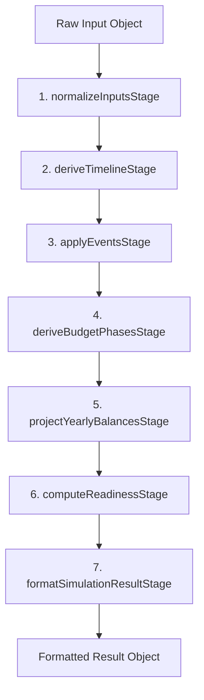

# Project Architecture - Cash vs Mortgage & FIRE Simulator

This document describes the architectural layout, modules, boundaries, and extension guidelines for the Cash vs Mortgage / FIRE Simulator.

---

## 1. Simulation Pipeline Overview

The FIRE simulation engine is refactored into a **7-stage calculation pipeline** located under `src/calculators/fire/pipeline/`. The main entry point [index.js](file:///Users/adriannawenz/code/cash_vs_mortgage_calculator/src/calculators/fire/index.js) orchestrates these stages sequentially:

### Stages Description
1. **normalizeInputsStage**: Standardizes basic ranges, calculates retirement ages, and handles childcare phase/spending regeneration.
2. **deriveTimelineStage**: Calculates Social Security claiming multipliers, benefits, and Year 0 progressive taxes.
3. **applyEventsStage**: Generates the primary simulation `profile` and `events` objects.
4. **deriveBudgetPhasesStage**: Partitions years into specific life stages based on events.
5. **projectYearlyBalancesStage**: Runs the annual cash-flow ledger loops, liquidations, and compounding.
6. **computeReadinessStage**: Checks SWR, retirement age limits, and stop-work optionality.
7. **formatSimulationResultStage**: Maps calculated ranges to the output schema and gates debug tables/console logs.

---

## 2. Architectural Layers & Boundaries

We maintain a strict boundary-driven structure to separate pure math from React components:

### Domain / Calculator Layer (`src/domain/`, `src/calculators/`)
- **Rules**: Must contain **only pure JavaScript functions**. Imports of React, hooks, DOM APIs, or UI styles are strictly forbidden.
- **Input safety**: Must treat input objects as **immutable** (validated via deep-freezing in tests).

### Feature Layer (`src/features/`)
Couples the domain math to React state and manages specific application flows:
- **`src/features/fire/`**:
  - `useSimulationController.js`: Owns scenario CRUD (scenarios, active scenario, duplication, deletion) and coordinates simulation execution.
  - `useEventEditingController.js`: Manages editing workflows for timeline events and current conditions, including timeline drag-and-drop tracking and coord translation.
  - `useBudgetState.js`: Centralizes budget configuration, modal overlays, savings details, and pre/post-retirement income allocation tracking.
  - `useRecommendationController.js`: Coordinates recommendation applications and controls improvement modal overlays.
  - `useResponsiveFireView.js`: Small hook managing reactive mobile width detection and resize listeners.
- **`src/features/mortgage/`**: Contains components/styles for the Mortgage Comparer tool.
- **`src/features/calculator/`**: Contains components for the Simple Calculator tool.
- **`src/features/debt/`**: Contains components/styles for Credit Card Behavior tracking.

### Presentational Primitives (`src/features/fire/components/`)
- Shared components used by both desktop and mobile views:
  - `PhaseBadge.jsx`: Renders style-based life/financial phase badges.
  - `RecommendationCard.jsx`: Renders comparative recommendation cards.
  - `WorkOptionalCard.jsx`: Renders stops-working gauge indicators.
  - `BudgetSummaryCard.jsx`: Renders monthly budget cash allocations.
  - `TimelineEventCard.jsx`: Renders interactive nodes on the timeline.
  - `EventDetailsPanel.jsx`: Renders event details and actionable CTAs.
- **Rules**: Must be presentational. They must not run simulations, mutate scenario states, or import large controller hooks directly.

---

## 3. Event Handler & Saving Architecture

Life events (such as child, marriage, home purchase, and retirement) are managed via a decoupled handler system under `src/features/fire/events/`:

- **eventDefaults.js**: Acts as the single source of truth for creating initial event structures (`getDefaultEvent`).
- **eventSaveRouter.js**: Dispatches saving, editing, and deletion requests to domain handlers:
  - `childEventHandler.js`: Handles childcare budgets and timeline overrides.
  - `houseEventHandler.js`: Handles down-payment liquidations and rebalances.
  - `marriageEventHandler.js` & `debtEventHandler.js`: Coordinate scenario inputs updates.

---

## 4. Recommendation System Architecture

Recommendations (e.g., delaying retirement, scaling savings, or rebalancing home purchase budgets) are coordinated by:

- **applyRecommendation.js**: A pure domain recommendation engine matching and executing scenarios.
- **useRecommendationController.js**: Integrates the engine with React state, coordinating side effects like open/close modals, budget inputs pre-population, and saving scenarios.

---

## 5. Extension Guidelines

### Adding a New Event Type
1. Define the event type key and its default fields inside `getDefaultEvent()` in [eventDefaults.js](file:///Users/adriannawenz/code/cash_vs_mortgage_calculator/src/features/fire/events/eventDefaults.js).
2. Create or extend a domain event handler under `src/features/fire/events/handlers/`.
3. Register the new event saving, edit, and deletion routing inside [eventSaveRouter.js](file:///Users/adriannawenz/code/cash_vs_mortgage_calculator/src/features/fire/events/eventSaveRouter.js).

### Adding a New Recommendation Type
1. Define the type key in [recommendationTypes.js](file:///Users/adriannawenz/code/cash_vs_mortgage_calculator/src/features/fire/recommendations/recommendationTypes.js).
2. Create a handler under `src/features/fire/recommendations/handlers/` executing the updates.
3. Hook the handler into `applyRecommendation()` inside [applyRecommendation.js](file:///Users/adriannawenz/code/cash_vs_mortgage_calculator/src/features/fire/recommendations/applyRecommendation.js).

---

## 6. Testing & Quality Expectations

To prevent architectural and functional regressions:
1. **Directory Boundaries**: Run `node test_architecture_boundaries.js` to ensure React imports do not pollute calculations or domain modules.
2. **Simulation Golden Suite**: All pipeline adjustments must pass [test_simulation_pipeline_golden.js](file:///Users/adriannawenz/code/cash_vs_mortgage_calculator/test_simulation_pipeline_golden.js) validating outcome shape and immutability.
3. **Changed and Full Runs**: Execute `npm run test:changed` during development and the full `npm run test` before committing/merging.
