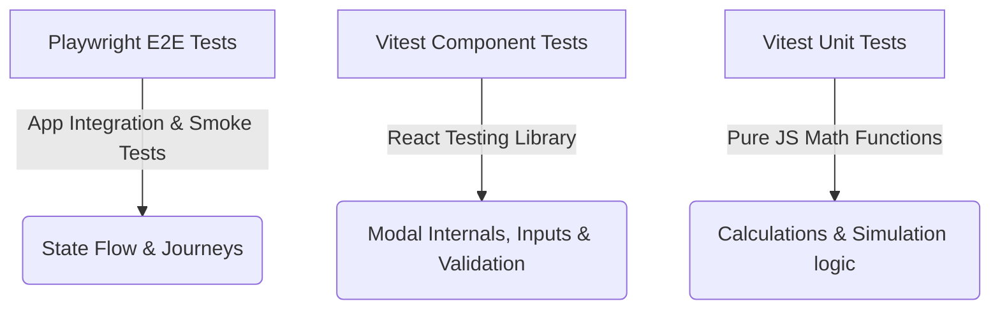

# Testing Responsibility Guidelines

This document outlines the testing responsibilities for the Cash vs. Mortgage Calculator application to maintain a fast, reliable, and high-confidence test suite.

## The Testing Pyramid

Our testing strategy splits responsibilities clearly between unit/component tests and end-to-end (E2E) tests:

---

## 1. Unit & Component Tests (Vitest + React Testing Library)

**Location**: Root directory (`test_*.js`, `test_*.jsx`)

These tests run in Node/JSDOM and are fast and isolated. Use them to cover the detailed state transitions, validation logic, cappings, rendering states, and callbacks.

### What to cover here:
* **Modal Triggering**: Assert that modals open when trigger buttons are clicked and close from "Cancel", "Done",backdrop, or Escape.
* **Fields & Default Values**: Verify that all form inputs are rendered with correct labels and start with their correct default values.
* **State Updates**: Verify that user inputs correctly update the local state of the form.
* **Validation & Capping**: Verify that error messages appear for invalid inputs and values are capped (e.g. APR capped at 36%).
* **Handlers & Payloads**: Verify that saving a modal triggers the save callback with the correctly built event payload.
* **Helper Copy & UI Styling**: Ensure that dynamic descriptions, warnings, alerts, and compassionate copy render correctly.

---

## 2. End-to-End (E2E) Tests (Playwright)

**Location**: `tests/*.spec.js`

These tests run in real browsers and are slower. They should be reserved for cross-component integrations and critical paths.

### What to cover here:
* **Happy-Path Smoke Tests**: Exactly one happy-path smoke test per major flow/modal to ensure buttons work and pages load.
* **Full User Journeys**: End-to-end flows like starting the application, selecting a tool, filling inputs, saving an event, and checking the summary.
* **State Propagation**: Verify that adding/editing an event in a modal propagates the state through the whole app (e.g. updates the timeline, updates the charts, and changes the retirement recommendation cards).
* **Cross-component integration**: Ensure different components (like the timeline, active budget, and outcome cards) sync and show consistent, non-broken values.
